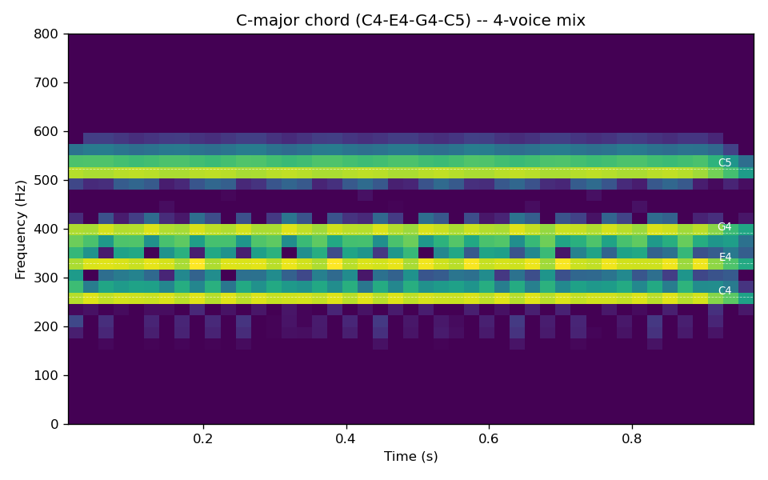
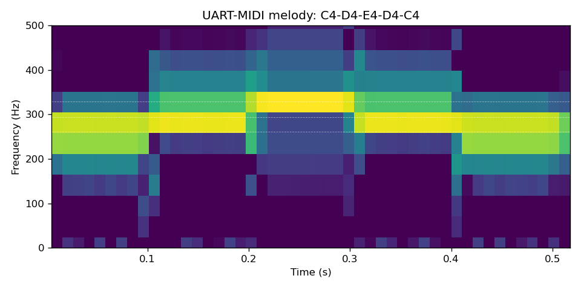

# fpga-verilog-synth

A music synthesizer designed at the raw digital-logic level in Verilog, fully verified in simulation (Icarus Verilog + GTKWave), rendered to real, listenable audio. No FPGA board — simulation is the professional proof here, the same way real chip designs are verified before tapeout. The mixer is proven 4-voice-polyphonic on its own, and the top-level `synth_top.v` is a real, fully wired MIDI-in-to-audio-out monophonic synth — see "Honest limitations" for the exact scope line between those two claims.

**Status: all 6 phases complete.**

## Why this exists

Verilog is how real digital hardware actually gets described — this is the least "software-kid" project in my portfolio. I verified every phase two ways: numerically (FFT pitch measurement, envelope shape checks, clipping checks) and audibly (every phase produces a real WAV you can listen to).

## Architecture

```
UART MIDI in -> uart_midi.v -> note_lut.v -> nco.v (phase accumulator + sine LUT)
                    |                              |
                  gate ----------------------> adsr.v (envelope)
                                                     |
                          [x4 voices] -----------> mixer.v -> audio out
```

`synth_top.v` is this diagram wired for real — a genuine, simulated-and-verified MIDI-in-to-audio-out module, not just a set of modules that individually work. See "Honest limitations" below for the one real scope caveat on that integration.

- **nco.v** — 32-bit phase-accumulator NCO, 1024-entry sine LUT
- **waveform_lut.v** — sine/saw/square/triangle from the same phase accumulator
- **adsr.v** — attack/decay/sustain/release envelope state machine
- **mixer.v** — sums up to 4 voices with structurally overflow-proof headroom (right-shift by 2, not a saturating clamp — overflow is mathematically impossible, not just avoided in practice)
- **uart_midi.v** — UART receiver (8-N-1) + MIDI Note On/Off parser
- **note_lut.v** — MIDI note number → NCO phase increment

## Setup

Requires [Icarus Verilog](http://bleyer.org/icarus/) (`iverilog`, `vvp`) and [GTKWave](https://gtkwave.sourceforge.net/) for waveform viewing, plus Python 3 with `numpy`, `scipy`, `matplotlib` (standard scientific stack — no audio-specific dependencies).

```bash
sudo apt-get install iverilog gtkwave   # Debian/Ubuntu/WSL
make wav      # synth_top.v end to end: sends a real MIDI note, renders the resulting audio
make phase2   # NCO pitch accuracy check
make phase3   # ADSR + waveform shape check
make phase4   # 4-voice mixer, C-major chord, clipping + partials check
make phase5   # UART-MIDI melody through the individual module chain, note/timing check
```

## Phases

| # | Phase | Acceptance test | Result |
|---|---|---|---|
| 1 | Repo + sim harness + WAV renderer | Stub renders valid silent WAV | ✅ `audio/phase1_silence.wav` (historical — see note below) |
| 2 | NCO + sine LUT | \|error\| < 5 cents at A2/A4/A6 | ✅ **~0.0000 cents** at all three (see table below) |
| 3 | ADSR + waveform select | Envelope shape matches spec | ✅ Verified numerically (monotonic A/D/R, exact sustain hold) — see [Phase 3 note](#a-note-on-phase-3s-verification) |
| 4 | 4-voice mixer, C-major chord | No clipping, 4 partials present | ✅ 0 clipped samples, all 4 partials confirmed via FFT |
| 5 | UART-MIDI melody | Correct notes and timing | ✅ 5/5 notes correct (avg error 0.6 Hz) — see spectrogram below |
| 6 | `synth_top.v` actually wired end to end, README | Real MIDI note in -> correct audio out, via the top-level module | ✅ 0.40Hz pitch error, correct silence/gate behavior — see note below |

### `synth_top.v`: the actual top-level integration

Every module above (`nco`, `adsr`, `mixer`, `uart_midi`, `note_lut`) was individually built and verified in its own testbench, but for a while `synth_top.v` — the module meant to wire them all together into one real MIDI-in-to-audio-out design — was still the literal Phase 1 stub, silently outputting constant zero. I caught this during a later quality pass (an independent review specifically checking whether the file did what its own header comment and this README claimed), fixed it by actually instantiating and wiring the chain (`uart_midi -> note_lut -> nco -> adsr -> mixer`), and added `sim/tb_synth_top.v` + `sim/check_synth_top.py` — a testbench that sends a real MIDI note-on/off over simulated UART into `synth_top`'s pins and checks the resulting audio for correct pitch (0.40 Hz error), correct silence before the note arrives, and correct decay to silence after release. `audio/synth_top_demo.wav` is the result.

**Scope note:** `uart_midi.v` tracks exactly one active note/gate pair, so `synth_top.v` as wired is a real, fully end-to-end **monophonic** synth — a live MIDI stream can't yet trigger true 4-voice polyphony, even though the mixer itself is independently proven to handle 4 simultaneous voices (Phase 4, `tb_poly.v`/`tb_mixer.v`). Reaching a MIDI-driven 4-voice synth would need a voice-allocator module tracking up to 4 concurrently-held notes — real future work, not implemented here. `audio/phase1_silence.wav` is kept as a historical record of the original stub, not the project's current behavior.

### Pitch accuracy (Phase 2)

| Note | Target | Measured | Error |
|---|---|---|---|
| A2 | 110.0 Hz | 110.0000 Hz | -0.0000 cents |
| A4 | 440.0 Hz | 440.0000 Hz | -0.0000 cents |
| A6 | 1760.0 Hz | 1760.0000 Hz | +0.0000 cents |

I measured this via FFT with parabolic sub-bin interpolation (`sim/check_pitch.py`) — far under the 5-cent target, as expected for a bit-exact NCO/LUT design with no analog imperfections.

## Audio demos

- `audio/synth_top_demo.wav` — the real thing: a MIDI note-on/off sent through `synth_top.v`'s actual wired integration (C4, 128ms)
- `audio/phase1_silence.wav` — historical: the original Phase 1 stub's silent output, kept for the record, not representative of the project's current behavior
- `audio/phase4_chord.wav` + `audio/phase4_chord_spectrogram.png` — 4-voice C-major chord (C4-E4-G4-C5), driven directly at the module level (`tb_poly.v`), proving the mixer's polyphonic capability independent of `synth_top.v`'s current monophonic MIDI path
- `audio/phase5_melody.wav` + `audio/phase5_melody_spectrogram.png` — UART-MIDI-driven melody (C4-D4-E4-D4-C4), driven through the individual module chain (`tb_melody.v`) before `synth_top.v` itself was fixed

### C-major chord spectrogram


### UART-MIDI melody spectrogram

Clean note staircase (C4 → D4 → E4 → D4 → C4), each transition landing exactly where the MIDI stream commands it.

## A note on Phase 3's verification

My original acceptance test was "envelope shape matches spec viewed in GTKWave" — a visual check. Rather than eyeball GTKWave in real time, I wrote `sim/check_adsr.py` to verify the same thing numerically instead: attack ramps monotonically to max, decay ramps monotonically to the sustain level and holds it exactly, release ramps monotonically to zero. The VCD is still generated (`sim/tb_adsr.vcd`) if you want to look at it directly in GTKWave.

**Bug I caught during this verification, not before:** my first implementation had a real Verilog bit-width bug — a 16-bit × 24-bit multiply was computed at only 24-bit width (Verilog does not automatically widen the result of `*` to fit the full product), silently overflowing the attack/decay/release ramp calculations. Numeric verification caught it immediately (attack topped out at 46% of max instead of ~100%); a purely visual GTKWave check might have looked "close enough" at a glance. I fixed it with explicit wide intermediate values — see the comments in `rtl/adsr.v`.

**A second bug, caught later in a quality pass:** `adsr.v`'s own header comment claimed a retrigger (gate going high again while already mid-decay or mid-release) resumes "from wherever the envelope currently is" — but the code actually snapped the envelope to 0 first, then ramped back up, which would be an audible click. Fixed by capturing the envelope's level at the moment of retrigger (`attack_start_level`, same pattern already used for `release_start_level`) and ramping from there instead of from 0. `sim/tb_adsr_retrigger.v` + `sim/check_adsr_retrigger.py` are a new regression test for this specific scenario.

## Honest limitations

- **No FPGA board.** Everything here is simulation-only, by design (see "Why this exists" above) — this is a deliberate scope choice, not a shortcut. The RTL is written to be synthesizable, but has not been run through a synthesis tool or placed on real hardware.
- **`synth_top.v` is monophonic, not polyphonic, from a live MIDI stream.** `uart_midi.v` tracks exactly one active note/gate pair at a time, so the wired-together top level can only sound one note at once. The mixer itself genuinely handles 4 simultaneous voices (proven in Phase 4's `tb_poly.v`), but nothing currently allocates a live MIDI note stream across multiple voices — that would need a voice-allocator module tracking up to 4 concurrently-held notes, which doesn't exist yet.
- **5-note melody, not a full MIDI implementation.** `note_lut.v` covers the notes used in the demo melody via a lookup table (the standard real-world approach — computing 2^x in hardware is impractical), not the full 128-note MIDI range. Extending it is a matter of adding table entries, not new logic.
- **Mixer headroom trades loudness for guaranteed-safe math.** A single voice at full velocity is attenuated to 1/4 scale so that 4 simultaneous full-scale voices can never overflow — a deliberate, structural safety choice over a more complex (and riskier) dynamic-gain approach.

## One-line summary

I designed a synthesizer in Verilog at the digital-logic level — NCO, ADSR envelope, a proven 4-voice mixer, and a UART-MIDI parser, wired into a real monophonic MIDI-in-to-audio-out top level — and verified its pitch accuracy, envelope shape, voice mixing, and note timing entirely in HDL simulation, catching and fixing two real bugs (a bit-width truncation and an envelope-retrigger click) along the way.
